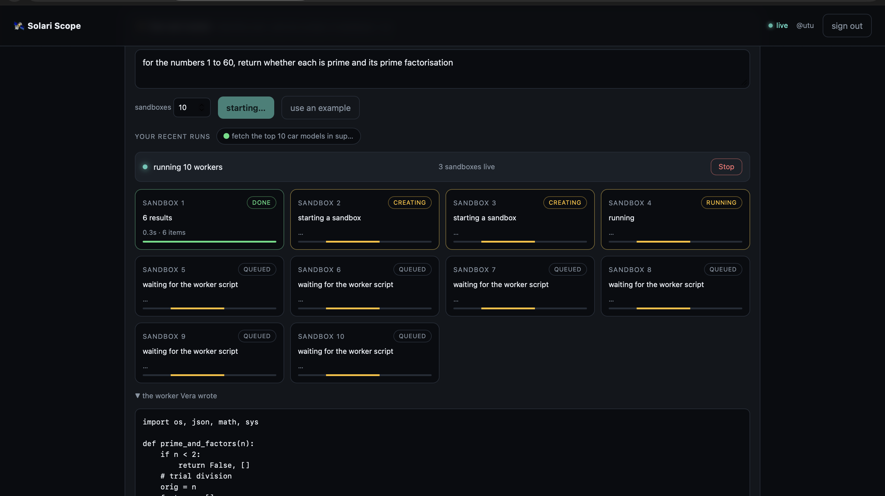
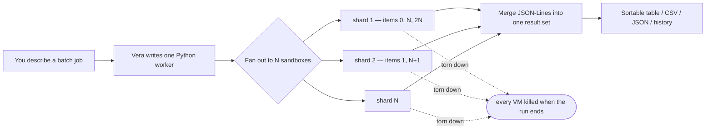
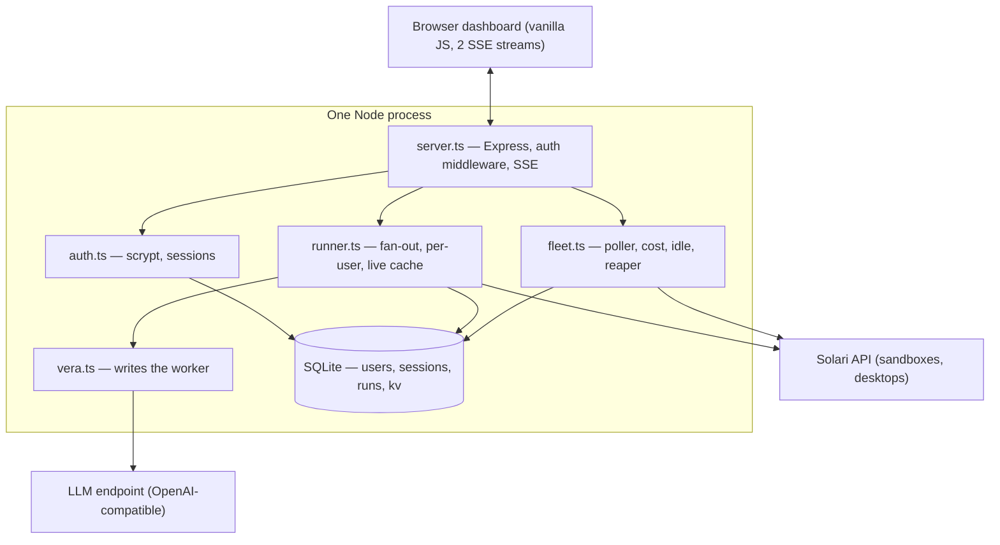

<div align="center">

# 🛰️ Solari Scope

### Run a real batch job across a fleet of [Solari](https://getsolari.com) sandboxes — and watch what it costs.

Describe a job in plain English. **Vera** writes one Python worker.
**Solari** runs it on *N* isolated microVMs in parallel.
**Scope** shards the work, streams every worker's output back, merges it — and never lets a VM leak.

<br/>


<br/>



<sub>10 sandboxes fanned out for one job — one already `DONE` with 6 results, the rest `CREATING` / `QUEUED`, all streaming live.</sub>

</div>

---

## How a job runs



Each worker is told it's `WORKER_INDEX` of `WORKER_COUNT` and processes only its
slice. It gets real internet and `pip`. It prints **one JSON line per item —
including failures** — so nothing disappears silently. Scope parses those lines
as they stream and merges them.

---

## Why it exists

Solari bills by the minute. The thing that quietly runs up the bill is a VM
**nobody released** — an agent throws halfway through, its cleanup never runs, and
a microVM sits on the meter until timeout. Times every crash, every run, every
developer.

A batch-job runner that forgets to clean up *is that problem*. So Scope is both
halves at once:

<table>
<tr>
<td width="50%" valign="top">

### ⚡ The runner

- Plain-English job → **Vera** writes the worker
- Fans out to *N* sandboxes, **pooled** — retries Solari's concurrency limit so a
  1-slot plan just runs sequentially instead of erroring
- **Live SSE** — per-worker status, result count, and the merged set stream in
- **Stop** mid-run — sandboxes killed immediately
- Results as a **sortable table** or raw JSON · **CSV / JSON export**
- Every run saved to **your** history, re-openable

</td>
<td width="50%" valign="top">

### 🛰️ The safety rail

- Every sandbox & desktop on the account, live — age, CPU, memory, **$ / hour**
- **Projected** daily / monthly cost + a burn-rate **sparkline**
- A **budget** you set → KPIs turn red with a banner
- The **oldest running session** called out (that's the forgotten one)
- A **reaper** that kills CPU-idle VMs — `dry-run` first so you watch it decide
- One-click kill for anything

</td>
</tr>
</table>

---

## Quickstart

> Needs **Node 22+**.

```bash
git clone git@github.com:PARTHDESHMUKH2005/solari-demo.git
cd solari-demo
npm install
cp .env.example .env      # fill in SOLARI_API_KEY and VERA_API_KEY
npm start
```

Open **<http://localhost:3000>**, click **Create an account**, describe a job,
pick a sandbox count, hit **Run job**.

Two env vars matter — everything else has a default:

| | |
|---|---|
| `SOLARI_API_KEY` | **required** — `slr_live_…` from console.getsolari.com |
| `VERA_API_KEY` | turns on the runner — an API key for any OpenAI-compatible chat endpoint |

<details>
<summary><b>All configuration</b></summary>

<br/>

| Variable | Default | Purpose |
| --- | --- | --- |
| `SOLARI_API_KEY` | — | **Required.** `slr_live_...` |
| `VERA_API_KEY` | _(none)_ | API key for Vera's LLM endpoint — turns on the fan-out runner |
| `VERA_BASE_URL` | _(OpenAI-compatible default)_ | Point Vera at a different provider |
| `VERA_MODEL` | _(a sensible default)_ | The chat model Vera uses |
| `VERA_MAX_TOKENS` | `4096` | Raise if Vera's worker is cut off on a complex job |
| `PORT` | `3000` | HTTP port |
| `SIGNUP_CODE` | _(none)_ | If set, new accounts must supply this code. Empty = open sign-up |
| `SCOPE_DB_FILE` | `.scope.db` | SQLite file — accounts, sessions, per-user history, fleet state |
| `BUDGET_USD` | `0` | Warn once observed spend crosses this (`0` = off; UI can also set one) |
| `FANOUT_CONCURRENCY` | `1` | Sandboxes to create at once — set to your Solari plan's limit |
| `FANOUT_MAX_WORKERS` | `20` | Upper bound on workers per run |
| `FANOUT_WORKER_TIMEOUT_MS` | `120000` | Hard cap per worker (pip installs + fetches need headroom) |
| `POLL_SECONDS` | `4` | How often Scope re-reads the fleet from Solari |
| `REAP_IDLE_MINUTES` · `REAP_MODE` | `0` · `dry-run` | Idle window before the reaper acts, and whether it only logs |
| `RATE_SANDBOX_PER_HOUR` · `RATE_DESKTOP_PER_HOUR` | `0.12` · `0.28` | $/hour for the cost estimate |

</details>

---

## Deploy

Scope is **one long-running Node process** — it holds SSE connections, an
in-memory poller, and a SQLite file. That rules out serverless (Vercel /
Lambda); use anything that runs a persistent Node service.

| Target | How |
| --- | --- |
| **Render** | New → Blueprint → point at the repo ([`render.yaml`](render.yaml) wires it) → add the two keys |
| **Railway / Fly / a VM** | `npm ci && npm run build && npm run start:prod` |
| **Docker** | `docker build -t solari-scope . && docker run -p 3000:3000 -e SOLARI_API_KEY=… solari-scope` |

Run **one instance** — the SQLite file is local. On a platform with an ephemeral
disk (Render free tier), point `SCOPE_DB_FILE` at a mounted volume to keep
accounts and history across deploys.

---

## Architecture



<details>
<summary><b>File map</b></summary>

```
src/
├── server.ts   Express: static UI + JSON API + SSE + auth middleware
├── db.ts       SQLite — users, sessions, runs, fleet kv
├── auth.ts     register / login / sessions (scrypt, no deps)
├── runner.ts   fan-out runner: job → worker → N sandboxes, per user
├── vera.ts     the planner — writes worker scripts (LLM call)
├── fleet.ts    the poller — Solari → Scope state, cost, idle, reaper
├── persist.ts  account-wide fleet state (spend, burn history)
├── config.ts   env parsing, one place
└── types.ts    shared shapes
public/         the dashboard — no build step, no framework
```

</details>

---

## Multi-user

Sign up with a username + password (open by default; `SIGNUP_CODE` gates it).
Passwords are **scrypt**-hashed with a per-user salt — `node:crypto` only, no
dependency. Sessions are random tokens in SQLite, so they **survive a restart**.

Every fan-out run is stored under the account that started it, and **every run
route checks ownership**:

```
alice runs a job  →  bob GET /api/run/<alice's id>   →  404 no such run
                     bob GET /api/runs                →  []
                     bob POST .../cancel              →  409
```

The **fleet view stays account-wide** — it's one Solari API key, so everyone
signed in sees the same live infrastructure and burn rate. The UI says so.

---

<details>
<summary><b>API reference</b></summary>

<br/>

All routes need `Authorization: Bearer <token>` (SSE routes take `?token=`)
except register / login / health.

| Route | Purpose |
| --- | --- |
| `POST /api/register` | `{ username, password, code? }` → `{ token, user }` |
| `POST /api/login` | `{ username, password }` → `{ token, user }` |
| `POST /api/logout` · `GET /api/me` | end / check the session |
| `POST /api/run` | `{ task, count }` → start a fan-out run under your account |
| `GET /api/runs` | **your** recent runs |
| `GET /api/run/:id` · `…/stream` | one of **your** runs (404 otherwise) — full state / SSE |
| `POST /api/run/:id/cancel` | stop one of your runs, kill its sandboxes |
| `GET /api/fleet` · `/api/stream` | account-wide fleet snapshot / SSE |
| `POST /api/kill/:id` | destroy one fleet session |
| `GET /api/health` | liveness + whether Vera / a signup code are configured |

</details>

<details>
<summary><b>Roadmap</b></summary>

<br/>

| Phase | Status |
| --- | --- |
| **0.** One-command run, `.env`, Docker / Render / Procfile | ✅ |
| **1.** Fleet view — live list, age, state, CPU/RAM, manual kill, SSE | ✅ |
| **2.** Cost meter + reaper — burn KPI, per-session cost, CPU-based idle, dry-run/live | ✅ |
| **3.** Fan-out runner — Vera → N sandboxes, list-sharding, per-item JSON, live SSE, 429-pooled, VMs torn down | ✅ |
| **4.** Operability — graceful shutdown, cancel, CSV/JSON, sortable table, history, projected cost, sparkline, budget, oldest-session callout | ✅ |
| **5.** Accounts — sign-up, sessions, per-user history in SQLite, ownership checks | ✅ |
| **6.** Session inspector — CPU/mem history, embedded VNC for desktops | 🔜 |

</details>

<details>
<summary><b>How the numbers work · limitations</b></summary>

<br/>

**Cost is an estimate, not a bill.** Solari has no machine-readable price list;
Scope counts each session's running seconds × the per-hour rate for its kind
(`RATE_SANDBOX_PER_HOUR` / `RATE_DESKTOP_PER_HOUR` — set them to your plan).
Counting starts when Scope first *sees* a session.

**Idle detection is CPU-based.** `expiresAt` gets nudged by keep-alive, so Scope
samples `metrics()` instead; a session at/below `REAP_CPU_IDLE_PCT` for the whole
window is idle. Anything Scope can't measure is treated as active — **the reaper
never kills on missing data.**

- **Single instance** — one SQLite file, local. Two instances each open their own.
- **The fleet is one Solari account** — accounts isolate *history*, not the infra.
- **Vera takes ~20–40 s to write a worker** — a one-time cost per run, shown with
  a live "thinking" timer. Point `VERA_MODEL` at a faster model to cut it.
- **Fleet view is sandboxes + desktops** — the browser SDK has no list-sessions call.

</details>

---

<div align="center">
<sub>MIT licensed · built on the Solari SDK · <a href="docs/">recording the demo</a></sub>
</div>
